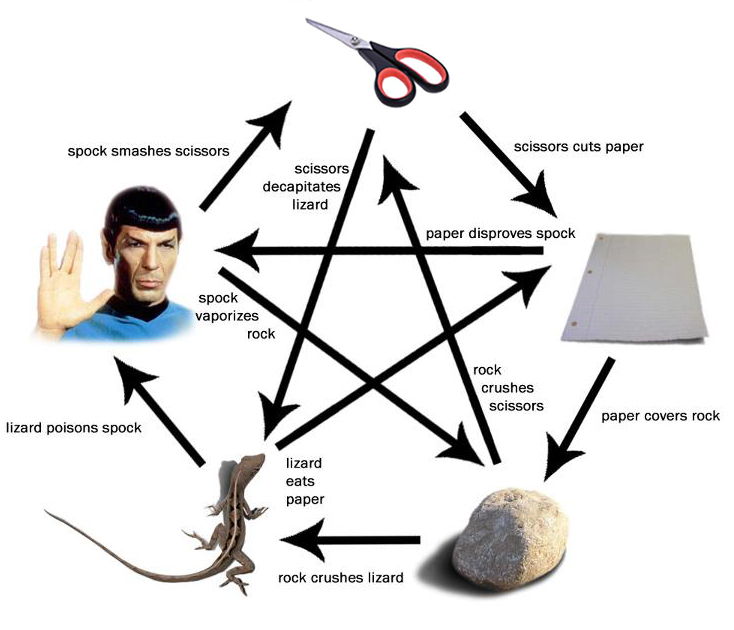

# rock-paper-scissors-lizard-spock 
A custom version of the popular game [Rock, Paper, Scissors.](https://en.wikipedia.org/wiki/Rock_paper_scissors)
made with Rust and inspired by the one seen on The Big Bang Theory sitcom.

# Rules:
Each player picks a variable and reveals it at the same time. 
The winner is the one who defeats the others. 
In a tie, the process is repeated until a winner is found.

Almost always, the boys will all pick Spock at the same time and tie over and over again.
Scissors cuts Paper

                    Paper covers Rock

                    Rock crushes Lizard

                    Lizard poisons Spock

                    Spock smashes Scissors

                    Scissors decapitates Lizard

                    Lizard eats Paper

                    Paper disproves Spock

                    Spock vaporizes Rock

                    (and as it always has) Rock crushes Scissors

This game has been built with Rust programming language with the aim of learning a bit about game programming.

It is based heavily on the example game found on riskpeep blog 
([post1](https://www.riskpeep.com/2022/07/rock-paper-scissors.html) and 
[post2](https://www.riskpeep.com/2022/07/rock-paper-scissors-game-in-rust-ii.html))
